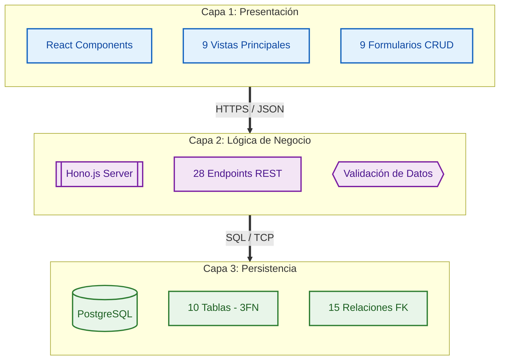
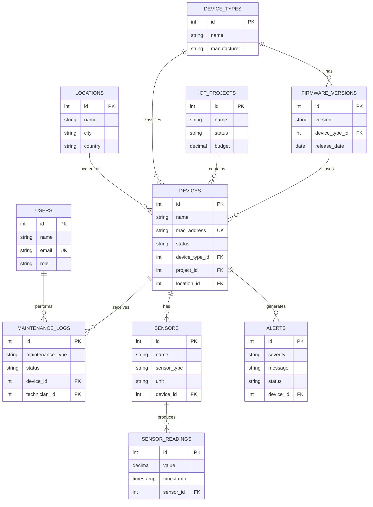

# Sistema de Gestión de Infraestructura IoT

---

## Integrantes del Equipo

| Apellidos y Nombres | Código |
|---------------------|--------|
| Alanya Carbajal Cristian |        |
| Mandujano Vicente Adriel |        |
| Morán de la Cruz Jhulio |        |
| Mucha Parra Mijail |        |
| Yurivilca Espinoza Hector |        |

**Curso**: Diseño de Base de Datos  
**Facultad**: Facultad de Ingeniería de Sistemas (FIS)  
**Universidad**: Universidad Nacional del Centro del Perú (UNCP)  
**Año Académico**: 2025

---

## Índice
1. [Introducción](#introducción)
2. [Objetivos del Proyecto](#objetivos-del-proyecto)
3. [Arquitectura del Sistema](#arquitectura-del-sistema)
4. [Stack Tecnológico](#stack-tecnológico)
5. [Modelo de Datos](#modelo-de-datos)
6. [Funcionalidades CRUD](#funcionalidades-crud)
7. [Análisis de Rendimiento](#análisis-de-rendimiento)
8. [Estructura del Proyecto](#estructura-del-proyecto)
9. [Documentación Técnica](#documentación-técnica)
10. [Conclusiones](#conclusiones)

## Introducción

Proyecto académico de bases de datos relacionales implementado como una aplicación web full-stack de gestión de infraestructura IoT. El sistema utiliza arquitectura de tres capas (presentación, lógica de negocio y persistencia) y demuestra conceptos avanzados de bases de datos mediante operaciones CRUD completas, consultas SQL complejas con JOINs múltiples, y normalización 3FN.

### Características Principales

**Base de Datos**:
- 10 tablas relacionales normalizadas en 3FN
- 15 relaciones de claves foráneas
- 13 índices optimizados
- Más de 800 registros de datos de ejemplo

**Backend API**:
- 28 endpoints REST (19 GET + 9 POST)
- Implementado con Hono.js en Supabase Edge Functions
- Consultas SQL con JOINs de hasta 5 tablas
- Validación de integridad referencial

**Frontend**:
- 9 componentes principales con visualización de datos
- 9 formularios CRUD completos
- Gráficos interactivos con Recharts
- Interfaz responsive con React + TypeScript + Tailwind CSS

## Objetivos del Proyecto

Este proyecto tiene como objetivo demostrar la implementación práctica de conceptos avanzados de bases de datos relacionales:

1. **Normalización de Bases de Datos**: Diseño normalizado en 3FN sin redundancia de datos
2. **Integridad Referencial**: Uso correcto de claves primarias, foráneas y constraints
3. **Consultas SQL Avanzadas**: JOINs múltiples, agregaciones, funciones de ventana, CTEs
4. **Arquitectura de Tres Capas**: Separación clara entre presentación, lógica y persistencia
5. **Operaciones CRUD Completas**: Creación, lectura, actualización (parcial) en todas las entidades
6. **Optimización de Consultas**: Uso estratégico de índices para mejorar rendimiento

## Arquitectura del Sistema

### Patrón de Tres Capas



### Componentes Principales

**Capa de Presentación**:
- `Dashboard.tsx` - Estadísticas generales del sistema
- `DeviceList.tsx` - Gestión CRUD de dispositivos
- `SensorReadings.tsx` - Visualización de lecturas con gráficos
- `AlertsList.tsx` - Sistema de alertas con filtros
- `MaintenanceLogs.tsx` - Historial de mantenimiento
- `ProjectsSummary.tsx` - Análisis agregado por proyecto
- `LocationsStats.tsx` - Estadísticas por ubicación
- `TechniciansPerformance.tsx` - Métricas de técnicos
- `SensorsAnalytics.tsx` - Análisis detallado de sensores

**Capa de Lógica de Negocio**:
- Servidor Hono.js con 28 endpoints REST
- 19 endpoints GET para consultas analíticas
- 9 endpoints POST para inserciones
- Validación de integridad referencial antes de inserciones

**Capa de Persistencia**:
- Base de datos PostgreSQL normalizada en 3FN
- 10 tablas con relaciones bien definidas
- Constraints para garantizar integridad de datos

## Stack Tecnológico

### Frontend

| Tecnología | Versión | Propósito |
|------------|---------|-----------|
| React | 18.2 | Biblioteca de UI basada en componentes |
| TypeScript | 5.0 | Tipado estático para JavaScript |
| Tailwind CSS | 4.0 | Framework de estilos utility-first |
| Recharts | - | Biblioteca de gráficos y visualización |
| Lucide React | - | Biblioteca de iconos |
| Sonner | 2.0.3 | Sistema de notificaciones toast |

### Backend

| Tecnología | Propósito |
|------------|-----------|
| Supabase Edge Functions | Plataforma serverless para backend |
| Hono.js | Framework web ligero para Deno |
| Deno | Runtime de JavaScript/TypeScript |
| PostgreSQL Client | Cliente de base de datos |

### Base de Datos

| Componente | Detalle |
|------------|---------|
| PostgreSQL | Sistema de gestión de base de datos relacional |
| Supabase Database | PostgreSQL gestionado en la nube |
| Normalización | Tercera Forma Normal (3FN) |
| Índices | 13 índices optimizados |
| Constraints | 15 restricciones de integridad |

## Modelo de Datos

### Diagrama Entidad-Relación



### Tablas del Sistema

| Tabla | Propósito | Relaciones |
|-------|-----------|------------|
| `users` | Usuarios del sistema (admin, engineer, technician, operator) | → maintenance_logs |
| `locations` | Ubicaciones geográficas de despliegue | → devices |
| `device_types` | Catálogo de tipos de dispositivos IoT | → devices, firmware_versions |
| `iot_projects` | Proyectos que agrupan dispositivos | → devices |
| `firmware_versions` | Control de versiones de firmware por tipo | → devices |
| `devices` | Dispositivos IoT desplegados | → sensors, alerts, maintenance_logs |
| `sensors` | Sensores asociados a dispositivos | → sensor_readings |
| `sensor_readings` | Datos de series temporales de sensores | - |
| `alerts` | Sistema de alertas del sistema | - |
| `maintenance_logs` | Registro de actividades de mantenimiento | - |

### Normalización 3FN

El diseño cumple estrictamente con las tres formas normales:

**Primera Forma Normal (1FN)**:
- ✓ Todos los atributos contienen valores atómicos
- ✓ Cada columna tiene un nombre único
- ✓ No existen grupos repetitivos
- ✓ Todas las tablas tienen clave primaria

**Segunda Forma Normal (2FN)**:
- ✓ Cumple 1FN
- ✓ Todos los atributos no clave dependen completamente de la clave primaria
- ✓ No hay dependencias parciales

**Tercera Forma Normal (3FN)**:
- ✓ Cumple 2FN
- ✓ No existen dependencias transitivas
- ✓ Todos los atributos no clave dependen únicamente de la clave primaria

## Funcionalidades CRUD

### Operaciones Implementadas

El sistema proporciona interfaces CRUD completas con formularios para todas las entidades:

| Entidad | Formulario | Campos | Validaciones FK |
|---------|------------|--------|-----------------|
| Proyectos | ✓ | name, description, status, budget, start_date | - |
| Ubicaciones | ✓ | name, address, city, country | - |
| Tipos de Dispositivos | ✓ | name, manufacturer | - |
| Usuarios | ✓ | name, email, role | - |
| Dispositivos | ✓ | name, mac_address, ip_address, status, device_type_id, project_id, location_id | device_types, iot_projects, locations |
| Sensores | ✓ | name, sensor_type, unit, min_value, max_value, device_id | devices |
| Lecturas | ✓ | value, timestamp, quality_score, sensor_id | sensors |
| Alertas | ✓ | severity, message, alert_type, status, device_id | devices |
| Mantenimiento | ✓ | maintenance_type, description, status, cost, device_id, technician_id | devices, users |

### Validación de Integridad Referencial

Todos los formularios implementan validación en cascada:

1. **Carga dinámica de opciones**: Los selects cargan datos de tablas relacionadas
2. **Prevención de huérfanos**: No se pueden crear registros con FK inválidas
3. **Mensajes de error específicos**: Notificaciones claras si falla la validación
4. **Orden de creación**: El sistema guía al usuario a crear registros en el orden correcto

**Ejemplo de flujo**:
```
Para crear un Sensor:
1. Primero debe existir un Proyecto
2. Luego debe existir una Ubicación
3. Luego debe existir un Tipo de Dispositivo
4. Luego se crea el Dispositivo (requiere 1, 2, 3)
5. Finalmente se puede crear el Sensor (requiere 4)
```

## Análisis de Rendimiento

### Estrategia de Indexación

**Índices en Claves Foráneas** (para optimizar JOINs):
```sql
CREATE INDEX idx_devices_project_id ON devices(project_id);
CREATE INDEX idx_devices_location_id ON devices(location_id);
CREATE INDEX idx_sensors_device_id ON sensors(device_id);
CREATE INDEX idx_readings_sensor_id ON sensor_readings(sensor_id);
CREATE INDEX idx_alerts_device_id ON alerts(device_id);
CREATE INDEX idx_maintenance_device_id ON maintenance_logs(device_id);
```

**Índices en Columnas de Búsqueda Frecuente**:
```sql
CREATE INDEX idx_devices_status ON devices(status);
CREATE INDEX idx_alerts_status ON alerts(status);
CREATE INDEX idx_alerts_severity ON alerts(severity);
CREATE INDEX idx_readings_timestamp ON sensor_readings(timestamp DESC);
```

**Índices Únicos** (para constraints):
```sql
CREATE UNIQUE INDEX idx_users_email ON users(email);
CREATE UNIQUE INDEX idx_devices_mac ON devices(mac_address);
```

### Volumen de Datos

El sistema contiene datos de ejemplo que demuestran diferentes escenarios:

| Tabla | Registros | Propósito |
|-------|-----------|-----------|
| users | 6 | Diferentes roles (admin, engineer, technician, operator) |
| locations | 6 | Ubicaciones geográficas variadas |
| device_types | 6 | Tipos de dispositivos IoT diversos |
| iot_projects | 5 | Proyectos en diferentes estados |
| firmware_versions | 6 | Versiones de firmware por tipo |
| devices | 11 | Dispositivos en varios estados |
| sensors | 19 | Sensores de diferentes tipos |
| sensor_readings | 850+ | Series temporales de datos |
| alerts | 8 | Alertas de diferentes severidades |
| maintenance_logs | 8 | Registros de mantenimiento |

### Escenarios de Datos

Los datos están organizados en 5 escenarios realistas del contexto IoT:

1. **Data Center** - Monitoreo de temperatura y humedad
2. **Control Industrial** - Sensores de vibración en maquinaria
3. **Calidad de Aire** - Medición de CO2, PM2.5 y VOC
4. **Gestión Energética** - Consumo eléctrico
5. **Recursos Hídricos** - Medición de flujo de agua

Estos datos son estáticos y sirven para demostrar las capacidades de consulta SQL con relaciones complejas entre tablas.

## Estructura del Proyecto

```
/
├── README.md                        # Este documento
├── database-schema.sql              # Script DDL completo
├── App.tsx                          # Componente raíz de React
│
├── components/                      # Componentes de interfaz
│   ├── Dashboard.tsx               # Dashboard principal
│   ├── DeviceList.tsx              # Lista de dispositivos
│   ├── SensorReadings.tsx          # Visualización de lecturas
│   ├── AlertsList.tsx              # Sistema de alertas
│   ├── MaintenanceLogs.tsx         # Historial de mantenimiento
│   ├── ProjectsSummary.tsx         # Análisis por proyecto
│   ├── LocationsStats.tsx          # Estadísticas por ubicación
│   ├── TechniciansPerformance.tsx  # KPIs de técnicos
│   ├── SensorsAnalytics.tsx        # Análisis de sensores
│   └── ui/                         # Componentes UI reutilizables
│       ├── button.tsx
│       ├── card.tsx
│       ├── badge.tsx
│       └── ...
│
├── supabase/functions/server/      # Lógica de backend
│   ├── index.tsx                   # Servidor Hono.js principal
│
├── utils/supabase/                 # Configuración de servicios
│   └── info.tsx                    # Credenciales de proyecto
│
├── styles/                         # Estilos globales
│   └── globals.css                 # CSS con Tailwind
│
└── docs/                           # Documentación técnica
    ├── DATABASE.md                 # Especificación de BD
    ├── ARCHITECTURE.md             # Arquitectura del sistema
    ├── API.md                      # Documentación de API
```

## Documentación Técnica

El proyecto incluye documentación técnica exhaustiva organizada en documentos especializados ubicados en el directorio `/docs/`:

### 📊 [Documentación de Base de Datos](./docs/DATABASE.md)

Análisis detallado del diseño de base de datos relacional:
- Diagrama Entidad-Relación completo
- Descripción técnica de las 10 tablas
- Análisis de normalización 3FN con ejemplos
- Especificación de relaciones y claves foráneas
- Estrategia de indexación y justificación
- Estimación de volumen de datos por tabla

### 🏗️ [Documentación de Arquitectura](./docs/ARCHITECTURE.md)

Especificación técnica de la arquitectura del sistema:
- Patrón de arquitectura de tres capas
- Diagramas de componentes y flujos
- Flujo de datos entre capas (lectura/escritura)
- Stack tecnológico completo con versiones
- Patrones de diseño implementados
- Consideraciones de rendimiento y optimización

### 🔌 [Documentación de API REST](./docs/API.md)

Especificación completa de la interfaz de programación:
- 28 endpoints REST documentados (19 GET + 9 POST)
- Especificación detallada de parámetros de entrada/salida
- Códigos de estado HTTP y manejo de errores
- Ejemplos de peticiones con cURL
- Formato de respuestas JSON
- Consultas SQL implementadas por endpoint


## Conclusiones

Este proyecto demuestra exitosamente la implementación de conceptos avanzados de bases de datos relacionales:

### Logros Técnicos

1. **Diseño de Base de Datos**
   - Normalización estricta en 3FN sin redundancia de datos
   - 15 relaciones de claves foráneas correctamente implementadas
   - 13 índices estratégicos para optimización de consultas

2. **Consultas SQL Avanzadas**
   - JOINs de hasta 5 tablas simultáneas
   - Funciones de ventana para análisis comparativo
   - CTEs para consultas modulares y legibles
   - Subconsultas correlacionadas y no correlacionadas

3. **Arquitectura de Software**
   - Separación clara de responsabilidades en tres capas
   - 28 endpoints REST bien estructurados
   - Validación de integridad en múltiples niveles

4. **Interfaz de Usuario**
   - 9 componentes principales con visualización de datos
   - 9 formularios CRUD completos con validación
   - Gráficos interactivos para análisis de series temporales

5. **Documentación Profesional**
   - 4 documentos técnicos especializados
   - Diagramas para visualización clara
   - Ejemplos de código y consultas SQL


---

**Versión**: 1.0.0  
**Fecha**: Diciembre 2025  
**Curso**: Diseño de Base de Datos  
**Facultad**: FIS - UNCP  
**Tecnologías**: React, TypeScript, PostgreSQL, Supabase