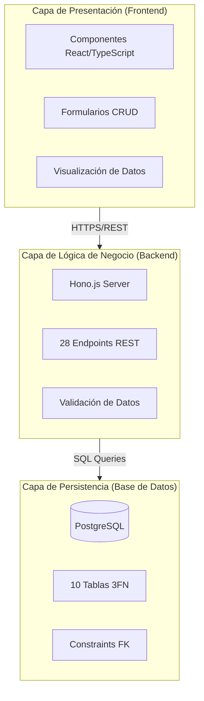
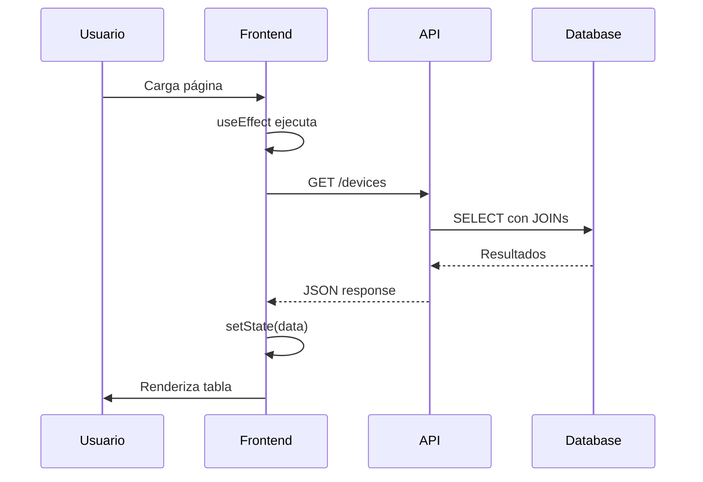
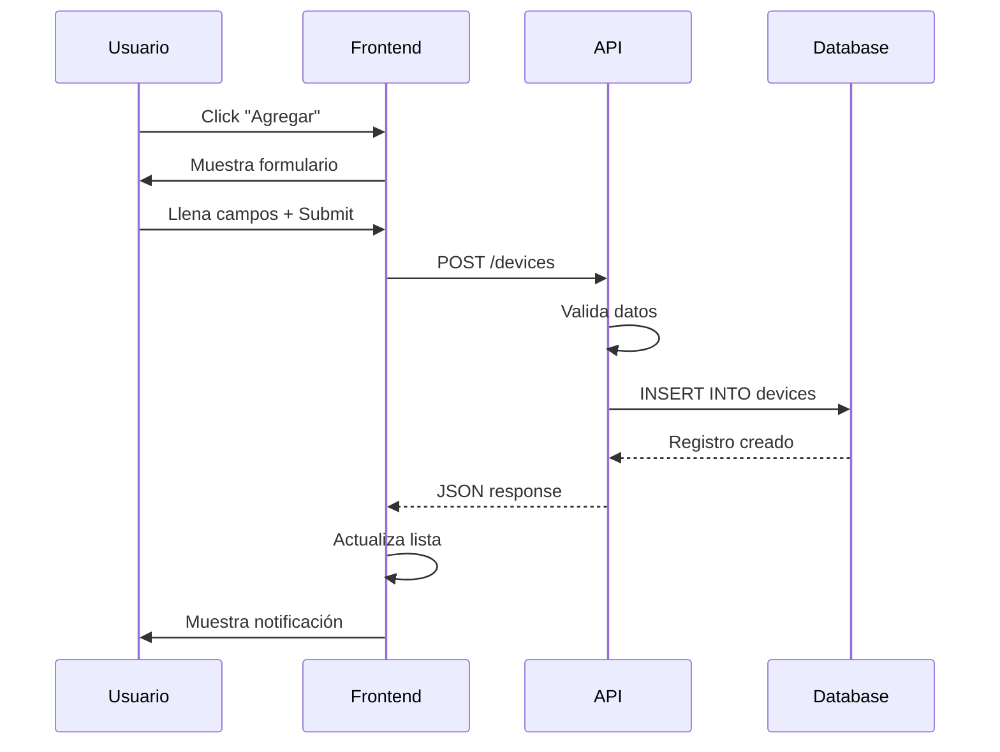
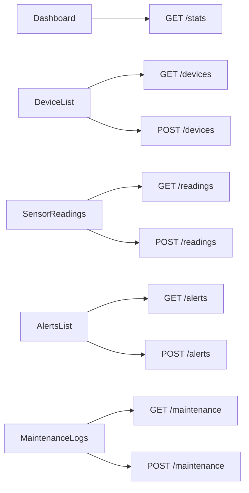

# Documentación de Arquitectura del Sistema

## Índice
1. [Introducción](#introducción)
2. [Patrón Arquitectónico](#patrón-arquitectónico)
3. [Stack Tecnológico](#stack-tecnológico)
4. [Capas del Sistema](#capas-del-sistema)
5. [Flujo de Datos](#flujo-de-datos)
6. [Diagrama de Componentes](#diagrama-de-componentes)
7. [Consideraciones Técnicas](#consideraciones-técnicas)

## Introducción

Este documento describe la arquitectura técnica implementada en el proyecto académico de Sistema de Gestión de Infraestructura IoT. El sistema utiliza una arquitectura de tres capas moderna con clara separación de responsabilidades entre presentación, lógica de negocio y persistencia de datos.

### Objetivos del Diseño Arquitectónico
- **Separación de Concerns**: Clara división entre presentación, lógica y datos
- **Mantenibilidad**: Estructura de código organizada y comprensible
- **Rendimiento**: Consultas SQL optimizadas con índices estratégicos
- **Integridad de Datos**: Validación de relaciones de claves foráneas
- **Escalabilidad Futura**: Diseño modular que permite crecimiento

## Patrón Arquitectónico

### Arquitectura de Tres Capas



### Responsabilidades por Capa

#### Capa 1: Presentación (Frontend)
- Renderizado de componentes React
- Manejo de interacciones del usuario (clicks, inputs)
- Visualización de datos en tablas y gráficos
- Formularios para operaciones CRUD
- Validación básica en cliente

#### Capa 2: Lógica de Negocio (Backend)
- 19 endpoints GET para consultas de datos
- 9 endpoints POST para inserciones
- Ejecución de consultas SQL con JOINs
- Transformación de datos para el frontend
- Validación de integridad referencial

#### Capa 3: Persistencia (Base de Datos)
- Almacenamiento de datos en PostgreSQL
- Aplicación de constraints (PK, FK, UNIQUE, CHECK)
- Índices para optimización de consultas
- Normalización 3FN

## Stack Tecnológico

### Frontend

**Tecnologías Principales**:
- **React 18.2**: Biblioteca de UI basada en componentes
- **TypeScript 5.0**: Tipado estático para JavaScript
- **Tailwind CSS v4**: Framework de estilos utility-first
- **Lucide React**: Biblioteca de iconos
- **Recharts**: Biblioteca de gráficos
- **Sonner**: Sistema de notificaciones toast

### Backend

**Tecnologías Principales**:
- **Supabase Edge Functions**: Plataforma serverless
- **Hono.js**: Framework web ligero para Deno
- **Deno**: Runtime de JavaScript/TypeScript
- **PostgreSQL Client**: Cliente de base de datos

### Base de Datos

**Tecnología**:
- **PostgreSQL**: Sistema de gestión de base de datos relacional
- **Supabase Database**: PostgreSQL gestionado en la nube

## Capas del Sistema

### Capa de Presentación

**Estructura de Componentes**:
```
components/
├── Dashboard.tsx                # Estadísticas generales
├── DeviceList.tsx               # Lista y CRUD de dispositivos
├── SensorReadings.tsx           # Visualización de lecturas
├── AlertsList.tsx               # Lista y CRUD de alertas
├── MaintenanceLogs.tsx          # Registro de mantenimiento
├── ProjectsSummary.tsx          # Agregaciones por proyecto
├── LocationsStats.tsx           # Estadísticas por ubicación
├── TechniciansPerformance.tsx   # Desempeño de técnicos
├── SensorsAnalytics.tsx         # Análisis de sensores
└── ui/                          # Componentes reutilizables
    ├── button.tsx
    ├── card.tsx
    ├── badge.tsx
    └── ...
```

**Patrón de Comunicación**:
- Componentes hacen fetch a endpoints del backend
- Respuestas JSON se almacenan en estado local (useState)
- Re-renderizado automático al cambiar el estado

### Capa de Lógica de Negocio

**Servidor Hono.js** (`/supabase/functions/server/index.tsx`):

```typescript
// Ejemplo de estructura de endpoint
app.get('/make-server-5aa00d2c/devices', async (c) => {
  const { data, error } = await supabase
    .from('devices')
    .select(`
      *,
      device_types(name),
      locations(city),
      iot_projects(name)
    `)
    .order('created_at', { ascending: false });
  
  if (error) return c.json({ error: String(error) }, 500);
  return c.json(data);
});
```

**Endpoints Implementados**: 28 endpoints totales
- 19 endpoints GET (consultas)
- 9 endpoints POST (inserciones)

### Capa de Persistencia

**Esquema de Base de Datos**:
- 10 tablas normalizadas en 3FN
- 15 relaciones de claves foráneas
- 13 índices para optimización
- Más de 800 registros de datos de ejemplo

## Flujo de Datos

### Flujo de Lectura de Datos



### Flujo de Escritura de Datos (CRUD)



## Diagrama de Componentes

### Relación Componentes-Endpoints



### Componentes UI Reutilizables

Los componentes UI (Button, Card, Badge, etc.) son compartidos entre todos los módulos para mantener consistencia visual y reducir duplicación de código.

## Consideraciones Técnicas

### Optimización de Consultas SQL

**Índices Implementados**:
```sql
-- Índices en claves foráneas para JOINs rápidos
CREATE INDEX idx_devices_project_id ON devices(project_id);
CREATE INDEX idx_sensors_device_id ON sensors(device_id);
CREATE INDEX idx_readings_sensor_id ON sensor_readings(sensor_id);

-- Índices para ordenamiento
CREATE INDEX idx_readings_timestamp ON sensor_readings(timestamp DESC);
```

**Consultas con JOINs Múltiples**:
```sql
-- Ejemplo: Lecturas con información completa
SELECT 
  sr.*,
  s.name as sensor_name,
  s.sensor_type,
  d.name as device_name,
  p.name as project_name
FROM sensor_readings sr
INNER JOIN sensors s ON sr.sensor_id = s.id
INNER JOIN devices d ON s.device_id = d.id
INNER JOIN iot_projects p ON d.project_id = p.id
ORDER BY sr.timestamp DESC
LIMIT 100;
```

### Validación de Integridad Referencial

**En Base de Datos**:
- Constraints de claves foráneas previenen registros huérfanos
- CHECK constraints validan rangos de valores
- UNIQUE constraints previenen duplicados

**En Frontend**:
- Formularios cargan opciones desde tablas relacionadas
- Validación de campos requeridos antes de enviar
- Mensajes de error específicos

**En Backend**:
- Validación adicional de tipos de datos
- Logging de errores para debugging
- Respuestas HTTP apropiadas (200, 400, 500)

### Manejo de Errores

**Estrategia de Logging**:
```typescript
app.use('*', logger(console.log));

// Los errores se logean con contexto
console.error(`Error in ${endpoint}:`, error);
```

**Respuestas de Error**:
```typescript
if (error) {
  console.error('Database error:', error);
  return c.json({ 
    error: 'Failed to fetch devices',
    details: String(error)
  }, 500);
}
```

### Patrones de Diseño Utilizados

**1. Patrón Composición (React)**:
- Componentes pequeños y reutilizables
- Props para comunicación entre componentes
- Separación de lógica y presentación

**2. Patrón REST**:
- Endpoints siguiendo convenciones RESTful
- GET para lecturas, POST para inserciones
- Respuestas JSON consistentes

**3. Patrón de Normalización (Base de Datos)**:
- Tablas normalizadas en 3FN
- Eliminación de redundancia
- Uso de relaciones mediante claves foráneas

## Conclusiones

Esta arquitectura de tres capas proporciona:

1. **Separación Clara**: Cada capa tiene responsabilidades bien definidas
2. **Mantenibilidad**: Código organizado y fácil de entender
3. **Escalabilidad**: Diseño modular permite agregar nuevas funcionalidades
4. **Rendimiento**: Consultas optimizadas con índices apropiados
5. **Integridad**: Validación en múltiples niveles

El proyecto demuestra exitosamente la implementación de conceptos de arquitectura de software, diseño de bases de datos relacionales, y desarrollo full-stack moderno.

---

**Última Actualización**: Diciembre 2024  
**Versión**: 1.0.0  
**Tipo de Proyecto**: Académico - Bases de Datos Relacionales
