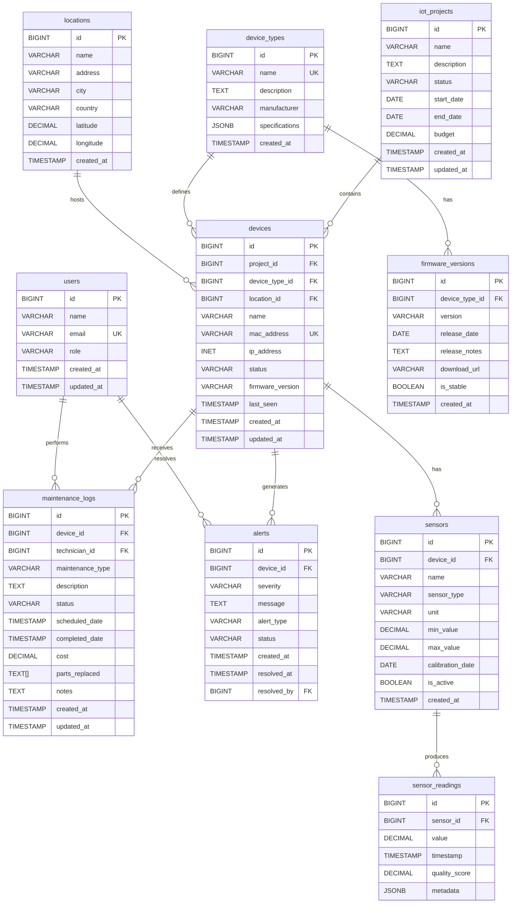
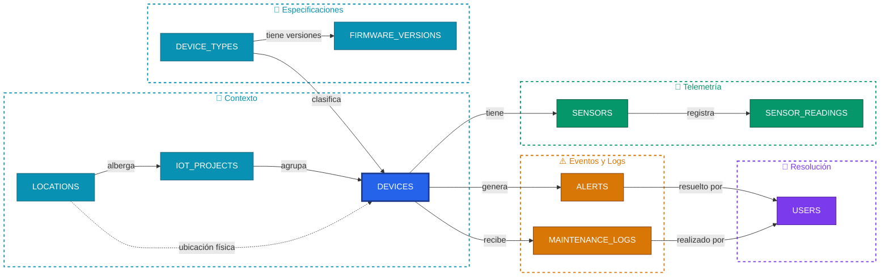

# Database Documentation

## Visión General

El sistema utiliza una base de datos PostgreSQL normalizada en Tercera Forma Normal (3FN) con 10 tablas interrelacionadas. La base de datos está diseñada para gestionar dispositivos IoT, sensores, lecturas en tiempo real, alertas y registros de mantenimiento.

## Diagrama Entidad-Relación



## Esquema de Relaciones



## Descripción Detallada de Tablas

### 1. users

**Propósito**: Almacena información de usuarios del sistema (administradores, ingenieros, técnicos, operadores).

**Columnas**:
- `id` (BIGSERIAL PK): Identificador único autoincrementado
- `name` (VARCHAR(100) NOT NULL): Nombre completo del usuario
- `email` (VARCHAR(150) UNIQUE NOT NULL): Correo electrónico único
- `role` (VARCHAR(50) NOT NULL): Rol del usuario
  - Valores permitidos: 'admin', 'engineer', 'technician', 'operator'
- `created_at` (TIMESTAMP WITH TIME ZONE): Fecha de creación
- `updated_at` (TIMESTAMP WITH TIME ZONE): Fecha de última actualización

**Relaciones**:
- 1:N con `maintenance_logs` (un usuario puede realizar múltiples mantenimientos)
- 1:N con `alerts` (un usuario puede resolver múltiples alertas)

**Restricciones**:
- CHECK: role IN ('admin', 'engineer', 'technician', 'operator')
- UNIQUE: email

**Índices**:
- PK en `id`
- UNIQUE en `email`

---

### 2. locations

**Propósito**: Almacena ubicaciones físicas donde se despliegan dispositivos IoT.

**Columnas**:
- `id` (BIGSERIAL PK): Identificador único autoincrementado
- `name` (VARCHAR(100) NOT NULL): Nombre de la ubicación
- `address` (VARCHAR(255) NOT NULL): Dirección completa
- `city` (VARCHAR(100) NOT NULL): Ciudad
- `country` (VARCHAR(100) NOT NULL): País
- `latitude` (DECIMAL(10,8)): Coordenada de latitud
- `longitude` (DECIMAL(11,8)): Coordenada de longitud
- `created_at` (TIMESTAMP WITH TIME ZONE): Fecha de creación

**Relaciones**:
- 1:N con `devices` (una ubicación puede tener múltiples dispositivos)

**Uso**:
Permite agrupar dispositivos por ubicación geográfica para análisis regional y asignación de técnicos.

---

### 3. device_types

**Propósito**: Catálogo de tipos de dispositivos IoT disponibles en el sistema.

**Columnas**:
- `id` (BIGSERIAL PK): Identificador único autoincrementado
- `name` (VARCHAR(100) UNIQUE NOT NULL): Nombre del tipo de dispositivo
- `description` (TEXT): Descripción detallada
- `manufacturer` (VARCHAR(100)): Fabricante del dispositivo
- `specifications` (JSONB): Especificaciones técnicas en formato JSON
- `created_at` (TIMESTAMP WITH TIME ZONE): Fecha de creación

**Relaciones**:
- 1:N con `devices` (un tipo puede tener múltiples instancias)
- 1:N con `firmware_versions` (un tipo puede tener múltiples versiones de firmware)

**Ejemplo de specifications**:
```json
{
  "connectivity": "WiFi/4G",
  "power": "12V DC",
  "max_sensors": 50,
  "protocol": "MQTT"
}
```

**Restricciones**:
- UNIQUE: name

---

### 4. iot_projects

**Propósito**: Proyectos que agrupan dispositivos IoT relacionados.

**Columnas**:
- `id` (BIGSERIAL PK): Identificador único autoincrementado
- `name` (VARCHAR(150) NOT NULL): Nombre del proyecto
- `description` (TEXT): Descripción del proyecto
- `status` (VARCHAR(50) NOT NULL): Estado actual del proyecto
  - Valores: 'active', 'inactive', 'completed', 'suspended'
- `start_date` (DATE NOT NULL): Fecha de inicio
- `end_date` (DATE): Fecha de finalización (nullable)
- `budget` (DECIMAL(15,2)): Presupuesto asignado
- `created_at` (TIMESTAMP WITH TIME ZONE): Fecha de creación
- `updated_at` (TIMESTAMP WITH TIME ZONE): Fecha de actualización

**Relaciones**:
- 1:N con `devices` (un proyecto contiene múltiples dispositivos)

**Restricciones**:
- CHECK: status IN ('active', 'inactive', 'completed', 'suspended')

---

### 5. firmware_versions

**Propósito**: Versiones de firmware disponibles para cada tipo de dispositivo.

**Columnas**:
- `id` (BIGSERIAL PK): Identificador único autoincrementado
- `device_type_id` (BIGINT FK NOT NULL): Referencia a device_types
- `version` (VARCHAR(50) NOT NULL): Número de versión (ej: "2.1.0")
- `release_date` (DATE NOT NULL): Fecha de lanzamiento
- `release_notes` (TEXT): Notas de la versión
- `download_url` (VARCHAR(500)): URL de descarga del firmware
- `is_stable` (BOOLEAN DEFAULT true): Indica si es versión estable
- `created_at` (TIMESTAMP WITH TIME ZONE): Fecha de creación

**Relaciones**:
- N:1 con `device_types` (cada versión pertenece a un tipo de dispositivo)

**Restricciones**:
- UNIQUE(device_type_id, version): No puede haber versiones duplicadas para un tipo
- ON DELETE CASCADE: Si se elimina el tipo, se eliminan sus versiones

**Índices**:
- idx_firmware_versions_device_type_id

---

### 6. devices

**Propósito**: Dispositivos IoT individuales desplegados en el sistema.

**Columnas**:
- `id` (BIGSERIAL PK): Identificador único autoincrementado
- `project_id` (BIGINT FK NOT NULL): Proyecto al que pertenece
- `device_type_id` (BIGINT FK NOT NULL): Tipo de dispositivo
- `location_id` (BIGINT FK): Ubicación física (nullable)
- `name` (VARCHAR(150) NOT NULL): Nombre identificativo del dispositivo
- `mac_address` (VARCHAR(17) UNIQUE NOT NULL): Dirección MAC única
- `ip_address` (INET): Dirección IP del dispositivo
- `status` (VARCHAR(50) NOT NULL): Estado operativo
  - Valores: 'online', 'offline', 'maintenance', 'error'
- `firmware_version` (VARCHAR(50)): Versión de firmware instalada
- `last_seen` (TIMESTAMP WITH TIME ZONE): Última conexión detectada
- `created_at` (TIMESTAMP WITH TIME ZONE): Fecha de creación
- `updated_at` (TIMESTAMP WITH TIME ZONE): Fecha de actualización

**Relaciones**:
- N:1 con `iot_projects` (cada dispositivo pertenece a un proyecto)
- N:1 con `device_types` (cada dispositivo tiene un tipo)
- N:1 con `locations` (cada dispositivo tiene una ubicación)
- 1:N con `sensors` (un dispositivo puede tener múltiples sensores)
- 1:N con `alerts` (un dispositivo puede generar múltiples alertas)
- 1:N con `maintenance_logs` (un dispositivo tiene historial de mantenimiento)

**Restricciones**:
- CHECK: status IN ('online', 'offline', 'maintenance', 'error')
- UNIQUE: mac_address
- ON DELETE CASCADE: project_id (si se elimina proyecto, se eliminan dispositivos)
- ON DELETE RESTRICT: device_type_id (no se puede eliminar tipo si hay dispositivos)
- ON DELETE SET NULL: location_id (si se elimina ubicación, se pone NULL)

**Índices**:
- idx_devices_status
- idx_devices_project_id
- idx_devices_location_id

---

### 7. sensors

**Propósito**: Sensores individuales instalados en dispositivos IoT.

**Columnas**:
- `id` (BIGSERIAL PK): Identificador único autoincrementado
- `device_id` (BIGINT FK NOT NULL): Dispositivo al que pertenece
- `name` (VARCHAR(100) NOT NULL): Nombre del sensor
- `sensor_type` (VARCHAR(100) NOT NULL): Tipo de sensor
  - Ejemplos: 'temperature', 'humidity', 'vibration', 'co2', 'power'
- `unit` (VARCHAR(50) NOT NULL): Unidad de medida (°C, %, mm/s, ppm, kW)
- `min_value` (DECIMAL(15,4)): Valor mínimo operativo
- `max_value` (DECIMAL(15,4)): Valor máximo operativo
- `calibration_date` (DATE): Fecha de última calibración
- `is_active` (BOOLEAN DEFAULT true): Sensor activo o desactivado
- `created_at` (TIMESTAMP WITH TIME ZONE): Fecha de creación

**Relaciones**:
- N:1 con `devices` (cada sensor pertenece a un dispositivo)
- 1:N con `sensor_readings` (un sensor produce múltiples lecturas)

**Restricciones**:
- ON DELETE CASCADE: Si se elimina dispositivo, se eliminan sus sensores

**Índices**:
- idx_sensors_device_id

---

### 8. sensor_readings

**Propósito**: Lecturas históricas de datos capturadas por sensores.

**Columnas**:
- `id` (BIGSERIAL PK): Identificador único autoincrementado
- `sensor_id` (BIGINT FK NOT NULL): Sensor que generó la lectura
- `value` (DECIMAL(15,4) NOT NULL): Valor medido
- `timestamp` (TIMESTAMP WITH TIME ZONE DEFAULT NOW()): Momento de la lectura
- `quality_score` (DECIMAL(3,2)): Calidad de la lectura (0.00 - 1.00)
- `metadata` (JSONB): Metadatos adicionales en formato JSON

**Relaciones**:
- N:1 con `sensors` (cada lectura pertenece a un sensor)

**Restricciones**:
- CHECK: quality_score >= 0 AND quality_score <= 1
- ON DELETE CASCADE: Si se elimina sensor, se eliminan sus lecturas

**Índices**:
- idx_sensor_readings_sensor_id
- idx_sensor_readings_timestamp (DESC) - Para consultas temporales

**Volumen de Datos**:
Esta es la tabla con mayor volumen de datos. Con sensores enviando lecturas cada minuto, puede crecer significativamente.

**Estrategia de Mantenimiento**:
- Considerar particionamiento por fecha
- Implementar políticas de retención (ej: mantener últimos 90 días en detalle)
- Agregaciones periódicas para datos históricos

---

### 9. alerts

**Propósito**: Alertas generadas automáticamente por el sistema ante condiciones anómalas.

**Columnas**:
- `id` (BIGSERIAL PK): Identificador único autoincrementado
- `device_id` (BIGINT FK NOT NULL): Dispositivo que generó la alerta
- `severity` (VARCHAR(50) NOT NULL): Nivel de severidad
  - Valores: 'low', 'medium', 'high', 'critical'
- `message` (TEXT NOT NULL): Mensaje descriptivo de la alerta
- `alert_type` (VARCHAR(100) NOT NULL): Tipo de alerta
  - Ejemplos: 'threshold_exceeded', 'connection_lost', 'anomaly_detected', 'sensor_error'
- `status` (VARCHAR(50) NOT NULL): Estado actual
  - Valores: 'active', 'acknowledged', 'resolved', 'dismissed'
- `created_at` (TIMESTAMP WITH TIME ZONE): Fecha de creación
- `resolved_at` (TIMESTAMP WITH TIME ZONE): Fecha de resolución
- `resolved_by` (BIGINT FK): Usuario que resolvió la alerta

**Relaciones**:
- N:1 con `devices` (cada alerta pertenece a un dispositivo)
- N:1 con `users` (usuario que resolvió, nullable)

**Restricciones**:
- CHECK: severity IN ('low', 'medium', 'high', 'critical')
- CHECK: status IN ('active', 'acknowledged', 'resolved', 'dismissed')
- ON DELETE CASCADE: device_id
- ON DELETE SET NULL: resolved_by

**Índices**:
- idx_alerts_device_id
- idx_alerts_status
- idx_alerts_severity

**Lógica de Negocio**:
- Alertas 'critical' requieren respuesta inmediata
- Alertas 'active' se muestran en dashboard principal
- Solo usuarios con rol 'admin' o 'engineer' pueden resolver alertas críticas

---

### 10. maintenance_logs

**Propósito**: Registro completo de actividades de mantenimiento realizadas en dispositivos.

**Columnas**:
- `id` (BIGSERIAL PK): Identificador único autoincrementado
- `device_id` (BIGINT FK NOT NULL): Dispositivo mantenido
- `technician_id` (BIGINT FK NOT NULL): Técnico asignado
- `maintenance_type` (VARCHAR(50) NOT NULL): Tipo de mantenimiento
  - Valores: 'preventive', 'corrective', 'emergency', 'upgrade'
- `description` (TEXT NOT NULL): Descripción del trabajo realizado
- `status` (VARCHAR(50) NOT NULL): Estado del mantenimiento
  - Valores: 'scheduled', 'in_progress', 'completed', 'cancelled'
- `scheduled_date` (TIMESTAMP WITH TIME ZONE): Fecha programada
- `completed_date` (TIMESTAMP WITH TIME ZONE): Fecha de finalización
- `cost` (DECIMAL(12,2)): Costo del mantenimiento
- `parts_replaced` (TEXT[]): Array de partes reemplazadas
- `notes` (TEXT): Notas adicionales del técnico
- `created_at` (TIMESTAMP WITH TIME ZONE): Fecha de creación
- `updated_at` (TIMESTAMP WITH TIME ZONE): Fecha de actualización

**Relaciones**:
- N:1 con `devices` (cada registro pertenece a un dispositivo)
- N:1 con `users` (cada registro es realizado por un técnico)

**Restricciones**:
- CHECK: maintenance_type IN ('preventive', 'corrective', 'emergency', 'upgrade')
- CHECK: status IN ('scheduled', 'in_progress', 'completed', 'cancelled')
- ON DELETE CASCADE: device_id
- ON DELETE RESTRICT: technician_id (no se puede eliminar técnico con trabajos registrados)

**Índices**:
- idx_maintenance_logs_device_id
- idx_maintenance_logs_technician_id
- idx_maintenance_logs_status

**Análisis de Datos**:
- Calcular MTTR (Mean Time To Repair)
- Identificar dispositivos con alto costo de mantenimiento
- Evaluar eficiencia de técnicos
- Planificar mantenimientos preventivos

---

## Normalización 3FN

### Primera Forma Normal (1FN)
- Todas las tablas tienen clave primaria (id)
- Todos los atributos contienen valores atómicos
- No hay grupos repetitivos
- Cada columna tiene nombre único

### Segunda Forma Normal (2FN)
- Cumple 1FN
- Todas las columnas no clave dependen completamente de la clave primaria
- No hay dependencias parciales

Ejemplo: En `devices`, todas las columnas (name, mac_address, status) dependen completamente de `id`, no de parte de una clave compuesta.

### Tercera Forma Normal (3FN)
- Cumple 2FN
- No hay dependencias transitivas
- Todos los atributos no clave dependen directamente de la clave primaria

Ejemplo: En lugar de almacenar `manufacturer` en `devices`, se almacena `device_type_id` que referencia a `device_types` donde está `manufacturer`. Esto elimina la dependencia transitiva: devices -> device_type -> manufacturer.

## Tipos de Relaciones

### One-to-Many (1:N)
- `users` -> `maintenance_logs`
- `locations` -> `devices`
- `device_types` -> `devices`
- `device_types` -> `firmware_versions`
- `iot_projects` -> `devices`
- `devices` -> `sensors`
- `devices` -> `alerts`
- `devices` -> `maintenance_logs`
- `sensors` -> `sensor_readings`

### Many-to-One (N:1)
Inversas de las relaciones 1:N mencionadas arriba.

### Relaciones Opcionales (Nullable FK)
- `devices.location_id` - Un dispositivo puede no tener ubicación asignada
- `alerts.resolved_by` - Una alerta puede no estar resuelta

## Estrategias de ON DELETE

### CASCADE
Eliminación en cascada cuando se elimina el padre:
- `iot_projects` -> `devices`
- `device_types` -> `firmware_versions`
- `devices` -> `sensors`
- `devices` -> `alerts`
- `devices` -> `maintenance_logs`
- `sensors` -> `sensor_readings`

### RESTRICT
Previene eliminación del padre si existen hijos:
- `device_types` -> `devices`
- `users` -> `maintenance_logs`

### SET NULL
Establece NULL en FK cuando se elimina el padre:
- `locations` -> `devices.location_id`
- `users` -> `alerts.resolved_by`

## Índices y Performance

### Índices Primarios (PK)
Automáticamente creados en todas las columnas `id`.

### Índices Únicos
- `users.email`
- `device_types.name`
- `devices.mac_address`
- `firmware_versions(device_type_id, version)` - Índice compuesto único

### Índices de Búsqueda
- `devices.status` - Búsquedas frecuentes por estado
- `alerts.severity` - Filtrado por severidad
- `alerts.status` - Filtrado por estado de alerta
- `sensor_readings.timestamp DESC` - Consultas temporales ordenadas

### Índices de Foreign Keys
Creados en todas las columnas FK para optimizar JOINs:
- `devices.project_id`
- `devices.device_type_id`
- `devices.location_id`
- `sensors.device_id`
- `sensor_readings.sensor_id`
- `alerts.device_id`
- `maintenance_logs.device_id`
- `maintenance_logs.technician_id`
- `firmware_versions.device_type_id`

## Consultas Típicas Optimizadas

### 1. Dispositivos con ubicación y proyecto
```sql
SELECT d.name, l.city, p.name as project
FROM devices d
LEFT JOIN locations l ON d.location_id = l.id
INNER JOIN iot_projects p ON d.project_id = p.id
WHERE d.status = 'online';
```
**Índices utilizados**: idx_devices_status, PK en locations y iot_projects

### 2. Alertas críticas activas con dispositivo
```sql
SELECT a.message, d.name, dt.name as device_type
FROM alerts a
INNER JOIN devices d ON a.device_id = d.id
INNER JOIN device_types dt ON d.device_type_id = dt.id
WHERE a.severity = 'critical' AND a.status = 'active';
```
**Índices utilizados**: idx_alerts_severity, idx_alerts_status, idx_alerts_device_id

### 3. Lecturas recientes de sensor específico
```sql
SELECT value, timestamp, quality_score
FROM sensor_readings
WHERE sensor_id = 123
ORDER BY timestamp DESC
LIMIT 100;
```
**Índices utilizados**: idx_sensor_readings_sensor_id, idx_sensor_readings_timestamp

## Estimación de Volumen de Datos

Basado en un sistema de tamaño medio:

| Tabla | Registros Estimados | Crecimiento |
|-------|---------------------|-------------|
| users | 50-100 | Bajo |
| locations | 10-50 | Bajo |
| device_types | 20-50 | Muy bajo |
| iot_projects | 10-30 | Bajo |
| firmware_versions | 100-200 | Bajo |
| devices | 500-5,000 | Medio |
| sensors | 2,000-20,000 | Medio |
| sensor_readings | 10M-100M+ | Alto |
| alerts | 10,000-100,000 | Medio-Alto |
| maintenance_logs | 5,000-50,000 | Medio |

## Conclusión

Este diseño de base de datos proporciona:
- Alta normalización para evitar redundancia
- Integridad referencial completa
- Flexibilidad para escalar
- Rendimiento optimizado con índices estratégicos
- Trazabilidad completa de operaciones
- Base sólida para análisis y reporting

---

**Versión**: 1.0.0  
**Fecha**: Diciembre 2025  
**Curso**: Diseño de Base de Datos  
**Facultad**: FIS - UNCP  
**Tecnologías**: React, TypeScript, PostgreSQL, Supabase
